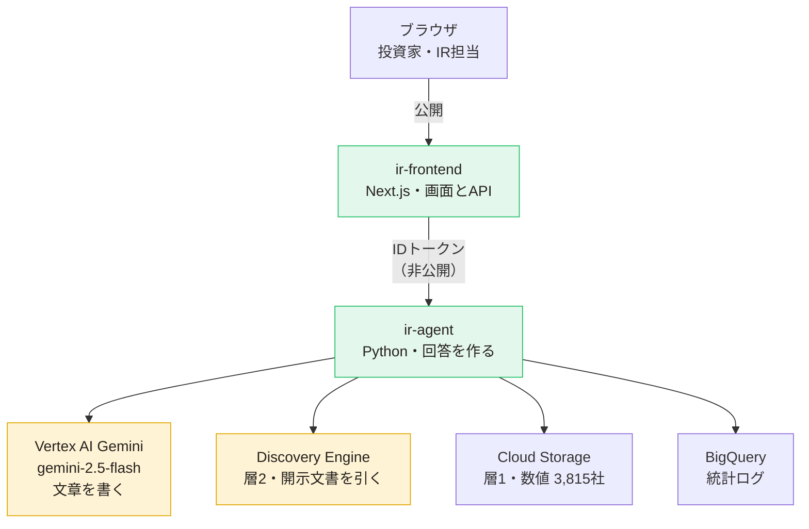
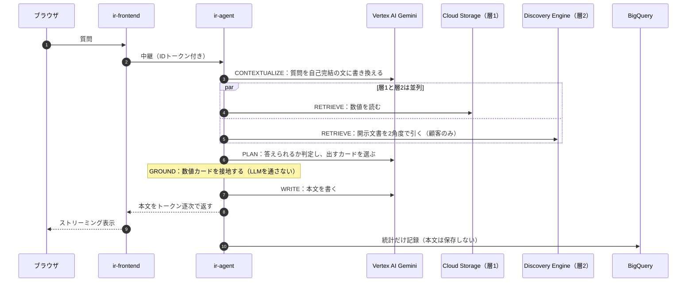

# Naruhodo IR（なるほどIR）

個人投資家が **選んだ上場企業の開示情報について自然言語で相談できる IR Agent**（B2B2C / 発行体に提供）。
開示済み情報のみを、**出典付きで・対話的に**答える（投資助言・将来予測・未開示情報は返さない）。

上場 **3,829社**が検索から到達でき、EDINETの有価証券報告書XBRLから決定論抽出した
**3,815社 / 200,767ファクト / 5期ぶん**の数値に、出典つきで答える。

> **ドキュメントの入口**
> - [`CLAUDE.md`](CLAUDE.md) … プロジェクト指示・全体像・実行/デプロイ（AI/エンジニアはまずこれ）
> - [`docs/ROADMAP.md`](docs/ROADMAP.md) … 残タスク（**生成物**。状態の正は GitHub Issue）
> - [`docs/ARCHITECTURE.md`](docs/ARCHITECTURE.md) … 設計詳細（二層グラウンディング・契約・マルチテナント）
> - [`docs/HANDOFF.md`](docs/HANDOFF.md) … 現状・実デプロイ済みリソース・再開手順
> - [`docs/DESIGN.md`](docs/DESIGN.md) … ブランド／デザインシステムの正
> - [`docs/edinet-ingest.md`](docs/edinet-ingest.md) … EDINET取り込みの実測値とハマりどころ

---

## アーキテクチャ

ブラウザが直接つながるのは `ir-frontend` だけ。`ir-agent` は**非公開**で、
フロントのサービスアカウントだけが呼べる（#88）。



**黄色が Vertex AI ＝ お金が動くのはここだけ。** Cloud Run・Cloud Storage・BigQuery は
合計しても月$0.01未満（実測）。

> **Discovery Engine は名前が3つある。** 同じ1つのサービスで、見る場所によって呼び名が変わる。
>
> | どこで見るか | 表示 |
> |---|---|
> | API・課金明細 | `discoveryengine.googleapis.com` |
> | 製品ドキュメント | Vertex AI Search |
> | **GCPコンソール** | **AI Applications** |
>
> コンソールで「Discovery Engine」を探しても見つからない。左メニューの「AI Applications」にある。

### 1問投げてから返るまでの順番



読みどころは3つ。

- **Gemini は1問につき3回**（①②④）。eval 44問で132回になるのはこれが理由
- **層1と層2は並列**なので待ち時間は増えない。層2を持たない企業ではそもそも走らない
- **③だけ LLM を通さない。** 数値カードはコードが層1から直接組み立てる。
  ②で Gemini が選ぶのは「どの指標を出すか」であって、値そのものではない

### 設計の背骨（崩さない）

- **数値の正確性は決定論で担保する。** `fact_cards` の数値は層1からコードが取得・計算し、
  LLMは生成しない。散文の数値は隣のカード＋出典でクロスチェックできる
- **二層グラウンディング**: 層1＝構造化財務ファクト（決定論）／層2＝開示文書の引用付き検索（定性）
- **ガードレール**: 投資助言・将来予測・未開示情報は答えない。不明・コーパス外は捏造せずIR窓口へ
- **マルチテナント**: 企業をハードコードしない。[`src/config/companies.ts`](src/config/companies.ts) が唯一の正

### 顧客 / 非顧客の階層（#145）

| | 根拠 | IR窓口への取り次ぎ | 表示 |
|---|---|---|---|
| **顧客** | 層1＋層2（決算説明資料など） | できる | 公式IR |
| **非顧客** | 層1のみ（EDINET提出書類） | できない | 非公式IR |

「公式」は発行体の承認を含意するので、契約していない企業には付けない（#124）。
**2026-08-06 時点で公式IRはハークスレイ(7561)のみ。**

---

## クイックスタート（ローカル）

```bash
# エージェント（:8080）
uv sync
cp agent/.env.example agent/.env
gcloud auth application-default login
gcloud auth application-default set-quota-project hallowed-trail-462613-v1
uv run uvicorn agent.server:app --port 8080

# フロント（:3000）
npm install
AGENT_URL=http://localhost:8080 npm run dev   # → http://localhost:3000

# 評価ハーネスのロジック確認（GCP不要・無料）
python3 eval/eval_harness.py --self-test
```

### eval（**実LLMを呼ぶ＝課金される**）

```bash
uv run python3 eval/eval_harness.py            # 反復中はこれ。旗艦ハークスレイ24問
uv run python3 eval/eval_harness.py --all      # PRを出す前に1回だけ。全3対象44問
```

`eval_harness.py` は `run_agent` を直接呼ぶので、Cloud Run を通らず**ローカル実行でも
Vertex AI に課金される**。本番の利用者は1日3〜6件なのに、開発中のevalで1日517回叩いた日がある。
既定を1社にしてあるのはこのため（**関門は緩めない**——数値100%/コンプラ0は維持し、頻度だけ落とす）。

## デプロイ（Cloud Run）

```bash
gcloud builds submit --config cloudbuild.agent.yaml   # ir-agent（非公開のまま）
gcloud run deploy ir-frontend --source . --region us-central1 --allow-unauthenticated --port 3000
```

## タスク管理

**状態の正は GitHub Issue。** Markdownに状態を書き写すと必ず腐るので二重に持たない。

- ラベル3軸: `type:` 何をするか / `area:` どこを触るか / `P0-now` `P1-next` `P2-later` いつやるか
- epic の進捗は**サブIssue**（GitHubが自動集計。手書きチェックボックスは使わない）
- [`docs/ROADMAP.md`](docs/ROADMAP.md) は**生成物**。CIが同期を検査する

```bash
uv run python scripts/sync_roadmap.py           # Issue変更後に再生成
uv run python scripts/sync_roadmap.py --check   # 食い違えば exit 1
```

## 技術スタック

Next.js 15 / TypeScript ・ Google ADK (Python) ・ Vertex AI Gemini ・ Discovery Engine ・
Cloud Run ・ Cloud Storage ・ BigQuery ・ Firebase Auth（全GCP）。

層1の数値は **1社1ファイルのJSON**。人が確認した顧客企業はイメージ同梱、
機械が作った3,815社は **GCS**（`FACTS_GCS_BUCKET`）から読む。同梱が優先
（人手検証済みの値を機械生成で上書きしない）。

## 現状

進捗と残タスクは [`docs/ROADMAP.md`](docs/ROADMAP.md) と GitHub Issue を見ること。
現状の詳細は [`CLAUDE.md`](CLAUDE.md) §8、実デプロイ済みリソースは [`docs/HANDOFF.md`](docs/HANDOFF.md)。
